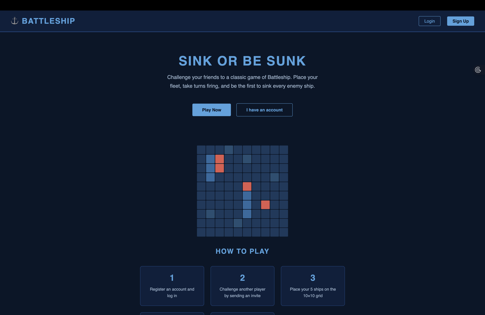
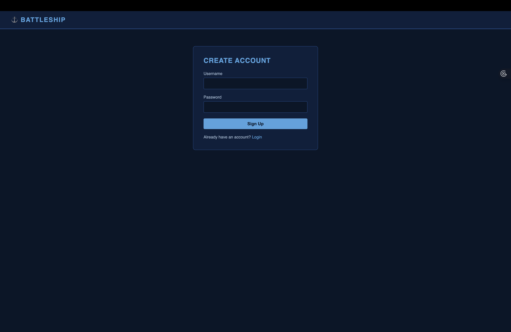
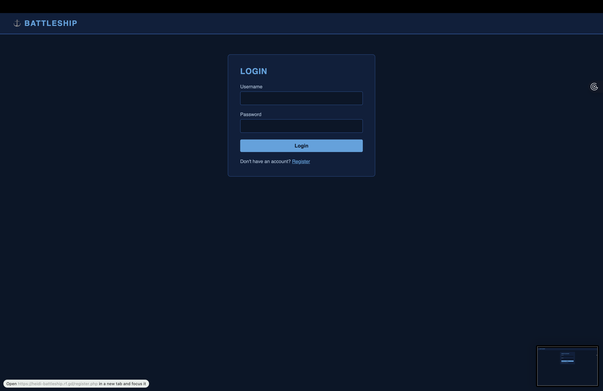
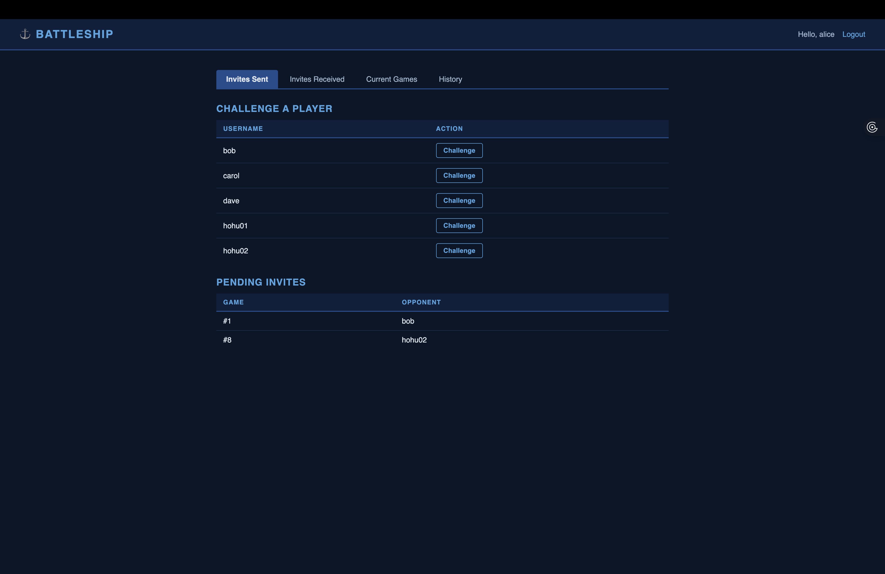
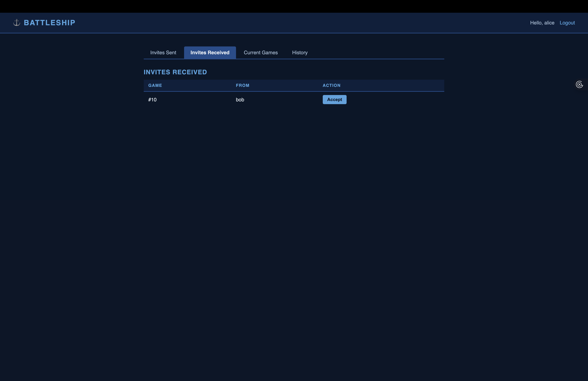
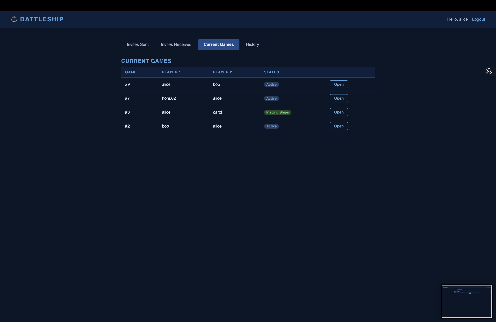
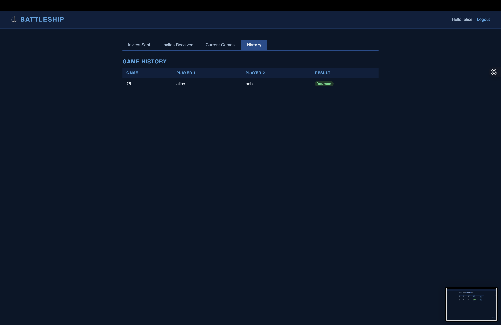
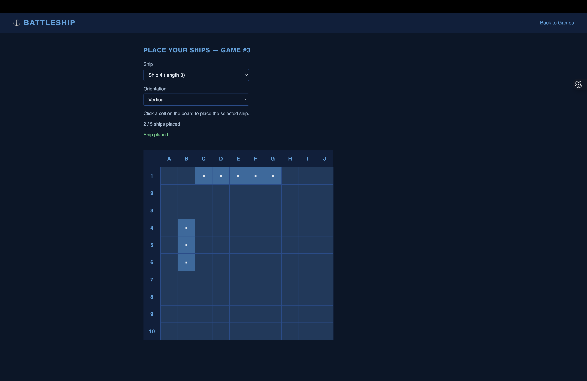
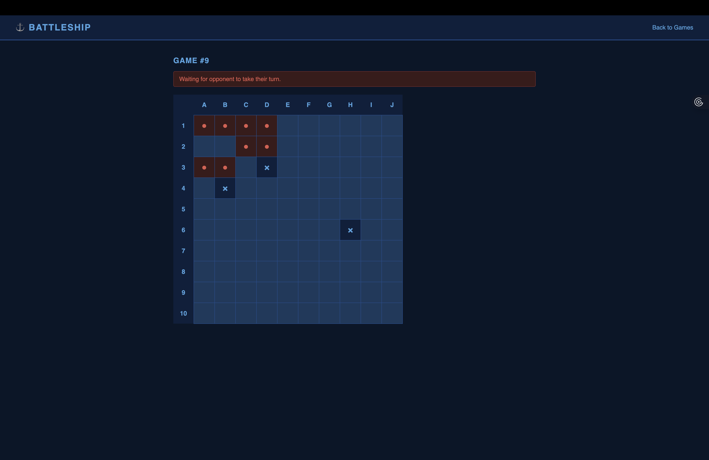
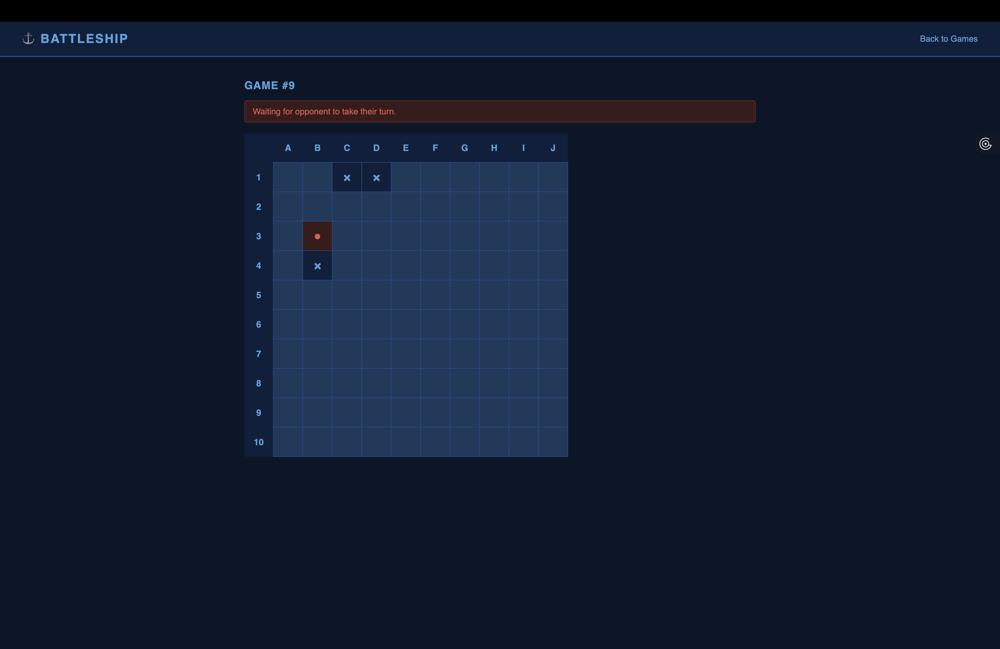

# Battleship

A two-player turn-based Battleship game built with PHP and MySQL.

**Live Demo:** https://heidi-battleship.rf.gd

## Screenshots

### Landing Page


### Authentication
 &nbsp; 

### Dashboard





### Ship Placement


### Gameplay



## Overview

Players register, log in, challenge each other, place their fleet on a 10×10 grid, and take turns firing at the opponent's board. The game is asynchronous — each player can log in and take their turn whenever they want. Hits let you keep firing; misses end your turn.

## Features

- User registration and login
- Challenge other registered users
- Ship placement phase with real-time AJAX board (no page reload)
- 10×10 interactive game board (A–J, 1–10)
- Turn enforcement — only the active player can fire
- Extra turn on a hit, switch on a miss
- Win detection when all opponent ships are sunk
- Game history with winner tracking
- Auto-refresh while waiting for opponent's move

## Tech Stack

- **Backend:** PHP 7+
- **Database:** MySQL
- **Frontend:** HTML/CSS (no framework)

## Live Demo Accounts

| Username | Password  |
|----------|-----------|
| alice    | alicepass |
| bob      | bobpass   |
| carol    | carolpass |
| dave     | davepass  |

## Local Setup

### 1. Configure the database

Copy `.env.example` to `.env` and fill in your MySQL credentials:

```
DB_HOST=localhost
DB_USERNAME=root
DB_PASSWORD=
DB_NAME=battleship
```

### 2. Initialize the database

Run `battle_ship.sql` in your MySQL client:

```bash
mysql -u root -p battleship < battle_ship.sql
```

Or visit `/setup.php` once after deploying to auto-create tables via the browser.

### 3. Serve the app

```bash
php -S localhost:8000
```

Then open `http://localhost:8000`.

## Game Flow

| Step | Status | Description |
|------|--------|-------------|
| 1 | Pending (0) | Player 1 sends a challenge |
| 2 | Placing (1) | Both players place their 5 ships |
| 3 | Active (2) | Players take turns firing |
| 4 | Finished (3) | All ships sunk — winner recorded |

## File Overview

| File | Purpose |
|------|---------|
| `connect_db.php` | DB connection, reads from `.env`, auto-creates tables |
| `login.php` | Login and authentication |
| `register.php` | New user registration |
| `logout.php` | Session teardown |
| `home.php` | Dashboard with nav tabs |
| `send_invite.php` | Send a game challenge |
| `accept_invite.php` | Accept a challenge |
| `place_ships.php` | AJAX ship placement board |
| `place_ship_ajax.php` | JSON endpoint for ship placement |
| `game.php` | Interactive game board |
| `make_move.php` | Records a move, enforces turns, detects winner |
| `views/sent.php` | Invites sent + challenge form |
| `views/received.php` | Invites received |
| `views/current.php` | Active and placing games |
| `views/history.php` | Finished games |
